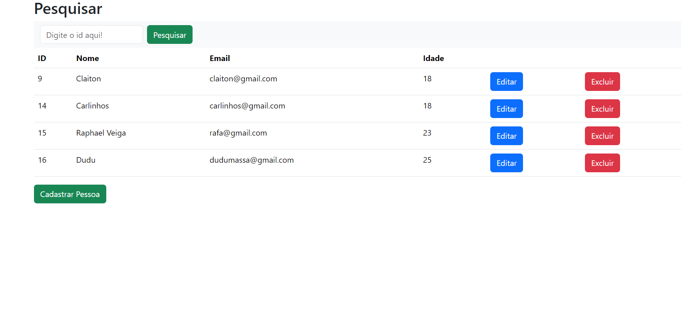

# Sistema de cadastro de pessoas

Aplicação Web + API que possibilita o cadastro de pessoas, utilizando Java + SpringBoot e Mysql. Possui algumas finalidades como: editar, deletar, vizualizar e pesquisar.

# Tecnologias Utilizadas
## Front-End
* [JavaScript](https://developer.mozilla.org/pt-BR/docs/Web/JavaScript)
* [CSS](https://developer.mozilla.org/en-US/docs/Web/CSS)
* [HTML](https://developer.mozilla.org/pt-BR/docs/Web/HTML)
* [Bootstrap](https://getbootstrap.com/docs/5.3/getting-started/introduction/)
## Back-End
* [Java](https://docs.oracle.com/en/java/)
* [SpringBoot](https://spring.io/projects/spring-boot)
* [Mysql](https://dev.mysql.com/doc/)
